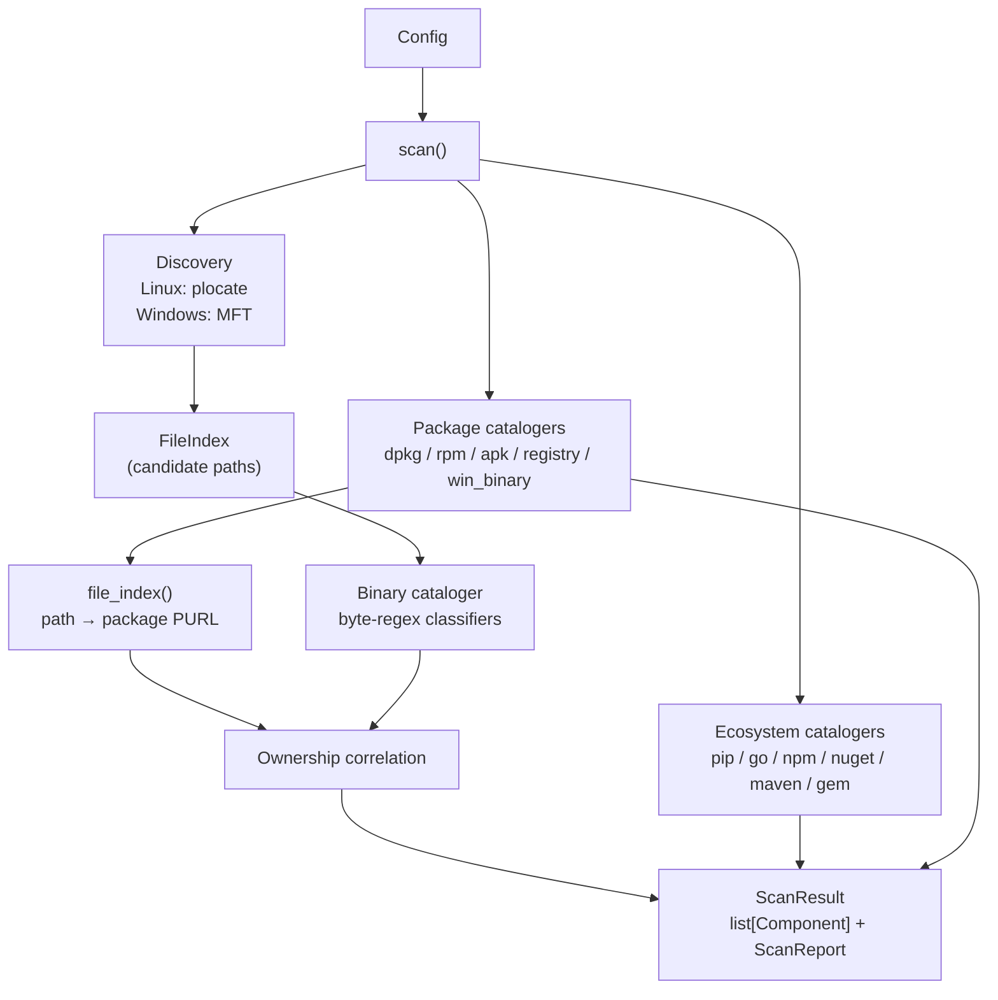

# Architecture

## Data flow



## Module map

```
glance/
  __init__.py          scan() — orchestrates all catalogers
  config.py            Config dataclass + YAML/JSON loader
  models.py            Component, ScanReport, ScanResult, Source, …
  cli.py               argparse CLI entry point

  catalogers/
    __init__.py        PACKAGE_CATALOGERS, ECOSYSTEM_CATALOGERS,
                       CATALOGER_GROUPS, expand_catalogers()
    dpkg.py            /var/lib/dpkg/status parser
    rpm.py             rpm -qa subprocess reader
    apk.py             /lib/apk/db/installed parser
    registry.py        Windows Uninstall registry reader (winreg)
    win_binary.py      Windows PE VERSIONINFO reader (ctypes)
    binary/
      __init__.py      BinaryCataloger — runs candidates through classifiers
      classifiers.py   Built-in Classifier definitions
      matchers.py      contents(), any_of(), branching(), … matcher factories
      loader.py        Load external classifier YAML/JSON files
    ecosystem/
      __init__.py      ECOSYSTEM_CATALOGERS dict
      base.py          EcosystemCataloger — walk + parse + deduplicate
      pip.py           requirements.txt, Pipfile.lock
      go.py            go.sum
      npm.py           package-lock.json, yarn.lock
      nuget.py         packages.config, *.packages.lock.json
      maven.py         pom.xml
      gem.py           Gemfile.lock

  discovery/
    __init__.py        discover_all() — Linux plocate / Windows MFT
    engines.py         get_plocate(), query(), anchors_for(), literal_anchor()
    gate.py            Gate (glob matching) + derive_globs()
    index.py           FileIndex — immutable candidate path set
    walk.py            read_mounts(), excluded_mount_prefixes() (FS-type filter)
    mft.py             Windows NTFS MFT enumeration

  correlate.py         OwnershipResolver + correlate() — managed/unmanaged tagging

  output/
    __init__.py        exports: to_cyclonedx, to_minimal, to_native, report_to_dict
    cyclonedx.py       CycloneDX 1.6 JSON serializer
    minimal.py         Flat list [{name, version, purl, cpe, path, source}]
    native.py          Internal format
    report.py          ScanReport → dict

  data/
    default_config.yaml
    default_updatedb.conf  Shipped updatedb.conf for deterministic DB coverage
    win_cpe_index.yaml     Registry cataloger CPE lookup table
    win_binary_index.yaml  Win binary cataloger product-name lookup table
```

## scan() step by step

`scan()` in `glance/__init__.py` is the single public entry point:

1. **Group expansion.** `expand_catalogers(config.catalogers)` turns group names
   (`software`, `ecosystem`) into individual cataloger names.

2. **Package catalogers.** For each cataloger in `PACKAGE_CATALOGERS` (dpkg,
   rpm, apk, registry, win_binary):
   - Skip if not in the enabled set.
   - Call `available()` — skip if not applicable on this host.
   - Call `catalog(report)` — collect `Component` objects.
   - Call `file_index()` — collect `{path → purl}` for ownership correlation.

3. **Discovery + binary cataloger.** If `binary` is enabled:
   - `discover_all(config, gate, extra_names, report)` — on Linux calls
     `get_plocate(config)` and queries the plocate DB; on Windows enumerates the
     NTFS MFT. Returns a `FileIndex`.
   - `BinaryCataloger(classifiers).catalog(index, config, report)` — reads and
     byte-regex-matches candidates from the FileIndex.
   - `correlate()` — marks each binary find as managed (owned by a package) or
     unmanaged.

4. **Ecosystem catalogers.** For each cataloger in `ECOSYSTEM_CATALOGERS` (pip,
   go, npm, nuget, maven, gem, distinfo, node_installed, jar, gem_installed):
   - Skip if not in the enabled set.
   - Instantiate with `paths=config.include_paths`.
   - Call `catalog(report, index=file_index)` — queries the FileIndex when
     available, otherwise walks the configured paths directly.

5. **Result assembly.** Components from all three stages are merged into
   `ScanResult(components, report)`.

## Component deduplication

Each cataloger is responsible for its own deduplication:

- **RegistryCataloger**: deduplicates by `(display_name.lower(), version.lower())` across all three registry hives.
- **WinBinaryCataloger**: deduplicates by `(index_id, version.lower())` — same product at different paths → one entry.
- **EcosystemCataloger (base)**: deduplicates by `(name.lower(), version.lower())` globally across all manifest files found.
- **BinaryCataloger**: merges same `(name, version)` finds into one component with multiple `occurrences`.
